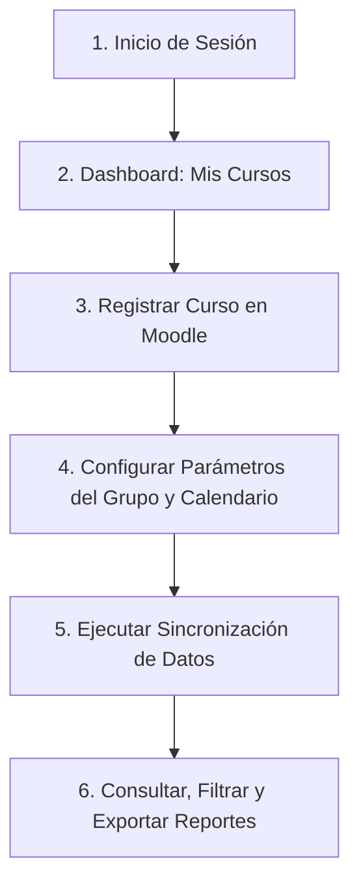
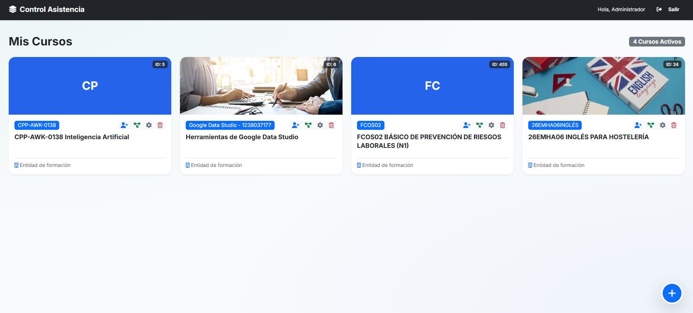
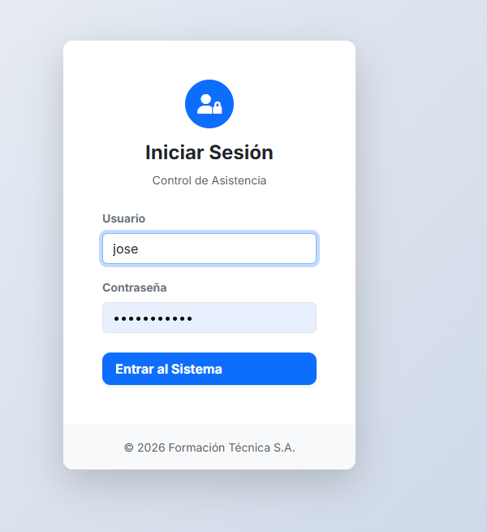
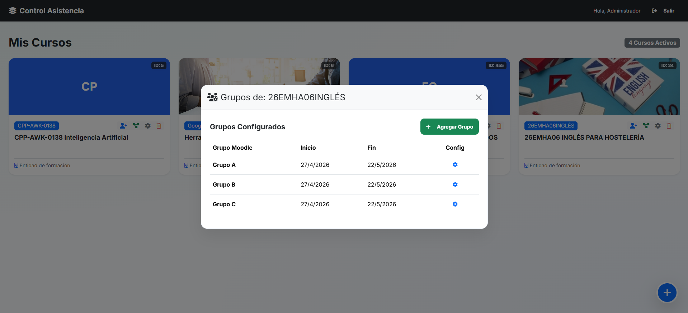
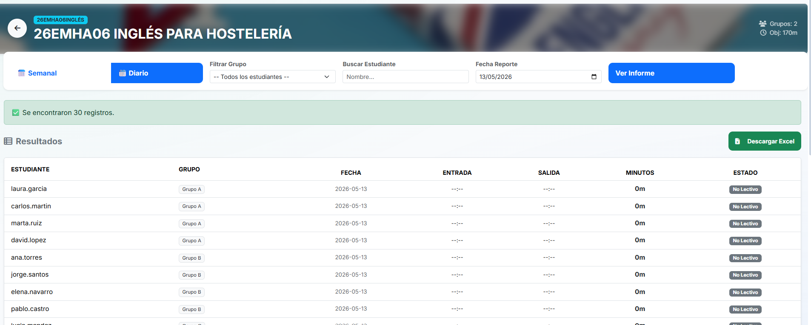

# Manual Operativo: Sistema Control Asistencia (Integrado con Moodle)

Este manual detalla el funcionamiento operativo de la aplicación **Control Asistencia**, diseñada para centralizar, gestionar y analizar el cumplimiento de la asistencia de los estudiantes matriculados en cursos sincronizados con la plataforma Moodle.

---

## 1. Introducción
La aplicación **Control Asistencia** es un sistema orientado a la gestión y seguimiento de asistencia académica, integrado directamente con Moodle. Su propósito principal es centralizar en una sola interfaz el registro de cursos, la configuración de reglas de asistencia por grupo, la gestión de inscripciones y la generación de reportes diarios y semanales utilizando criterios formales de cumplimiento (APTO / NO APTO).

Este documento describe cómo se usa la aplicación, qué acciones realizar en cada sección y para qué sirve cada módulo, sirviendo como guía de referencia operativa.

---

## 2. Objetivo de la Aplicación
La plataforma facilita las siguientes operaciones administrativas y docentes:
* **Sincronización con Moodle:** Registrar cursos activos de la plataforma Moodle en el sistema local utilizando WebServices (Tokens).
* **Parámetros Académicos:** Configurar objetivos de asistencia detallados (minutos diarios requeridos, umbral global de aprobación en porcentaje, calendario lectivo y feriados).
* **Gestión de Matrículas:** Administrar inscripciones de alumnos mediante herramientas de copia masiva y automatización condicional por prerrequisitos.
* **Consolidación de Actividad:** Sincronizar y procesar en tiempo real los registros de interacción y acceso de los alumnos.
* **Reportes Formales:** Generar análisis semanales y diarios del estado de cumplimiento de asistencia.
* **Exportación de Evidencias:** Descargar reportes en formatos estándar (Excel/CSV) para auditorías institucionales y archivos administrativos.

---

## 3. Flujo General de Uso (Visión Operativa)
Para asegurar la coherencia entre la configuración académica de los cursos y los resultados de los reportes, se recomienda seguir estrictamente la siguiente secuencia de pasos:

1. **Iniciar sesión:** Acceder de forma segura con sus credenciales de administrador o docente.
2. **Revisar "Mis Cursos":** Identificar el curso en el panel principal (Dashboard).
3. **Registrar nuevo curso:** Dar de alta un curso si es la primera vez que se gestiona en la app.
4. **Configurar parámetros de grupo:** Definir fechas de inicio/fin, horario, objetivo diario en minutos y marcar los feriados o días no lectivos correspondientes.
5. **Sincronizar:** Ejecutar la actualización de datos para traer la información más reciente desde Moodle.
6. **Consultar y Exportar:** Revisar los reportes semanales/diarios, aplicar filtros por alumno o grupo y exportar las evidencias (CSV/Excel).

---

## 4. Secciones de la App y Propósito de Cada Una

### 4.1 Pantalla de Acceso (Login)
* **Propósito:** Autenticar al usuario de manera segura antes de permitir operaciones en el sistema.
* **Funciones principales:**
  * Ingreso con usuario y contraseña autorizados.
  * Persistencia de sesión para evitar que el usuario deba reingresar sus credenciales constantemente durante su jornada.
  * Control de acceso inicial que protege los datos confidenciales de asistencia y la configuración del servidor.

| Vista de Inicio de Sesión |
| :---: |
|  |

---

### 4.2 Dashboard "Mis Cursos"
* **Propósito:** Centro neurálgico de operaciones donde se listan, organizan y administran todos los cursos dados de alta.
* **Elementos clave:**
  * **Tarjetas informativas por curso:** Muestran el código corto del curso, el nombre completo, la entidad a la que pertenece y accesos directos de administración.
  * **Botón flotante (+):** Ubicado en la esquina inferior para agregar de manera ágil nuevos cursos desde Moodle.

| Panel Principal "Mis Cursos" | Acciones Rápidas (Engranaje) |
| :---: | :---: |
|  |  |

* **Acciones rápidas por tarjeta de curso:**
  * **Entrar al módulo de reportes:** Se accede al hacer clic directo sobre la tarjeta del curso.
  * **Inscripción masiva de alumnos:** Permite migrar listados de estudiantes desde otros cursos.
  * **Inscripción condicional:** Permite automatizar inscripciones bajo reglas o prerrequisitos de otros cursos.
  * **Configuración por grupos:** Configuración fina de calendarios, horarios y metas del grupo.
  * **Eliminar curso:** Borra el curso y todos sus registros históricos locales asociados.

---

### 4.3 Modal "Agregar Nuevo Curso"
* **Propósito:** Registrar un curso en la base de datos local enlazándolo dinámicamente con la API de Moodle.
* **Datos a capturar:**
  1. **URL de Moodle:** La dirección web de la plataforma educativa.
  2. **Token de WebService:** Token de acceso de Moodle con los permisos requeridos para leer la base de datos de usuarios y logs.
  3. **ID del curso:** El identificador numérico interno del curso en Moodle.
  4. **Datos institucionales:** Entidad y CIF/Identificador tributario para la generación de reportes oficiales.
* **Resultado:** El curso queda guardado y disponible de inmediato en el Dashboard "Mis Cursos" para comenzar su parametrización.

---

### 4.4 Gestión de Grupos y Parámetros de Asistencia
* **Propósito:** Definir los límites y reglas académicas que gobernarán el procesamiento y cálculo de asistencia de los estudiantes.

| Configuración de Grupo | Calendario del Grupo |
| :---: | :---: |
|  |  |

#### Submódulos Incorporados:
1. **Listado de Grupos:** Muestra la lista de los diferentes grupos asociados a un mismo curso Moodle.
2. **Creación/Edición de Grupo:**
   * **Fecha de Inicio y Fin:** Delimita el rango de validez de las clases.
   * **Objetivo Diario (Minutos):** Cantidad de tiempo mínimo que un estudiante debe estar activo en la plataforma por día.
   * **Umbral Global (%):** Porcentaje mínimo de días "Apto" necesarios sobre el total de días lectivos para aprobar el curso (ej. 75%).
   * **Horario:** Días y horas en los que se imparte la asignatura.
3. **Calendario de Feriados:**
   * Permite marcar los días festivos, vacaciones o días no lectivos del periodo académico.
   * **Impacto funcional:** Los días marcados como feriados son excluidos automáticamente del denominador de días lectivos evaluados, de modo que **no penalizan la asistencia del alumno**.

| Creación de Nuevo Grupo | Configuración de Feriados |
| :---: | :---: |
|  |  |

---

### 4.5 Inscripción Masiva
* **Propósito:** Copiar de forma masiva y eficiente el listado de alumnos matriculados de un curso origen (ya existente) hacia un curso destino.

| Proceso de Inscripción Masiva - Paso 1 | Proceso de Inscripción Masiva - Paso 2 |
| :---: | :---: |
|  |  |

* **Flujo de uso:**
  1. Seleccionar el **curso origen** que contiene la lista de estudiantes deseada.
  2. Cargar y seleccionar a los alumnos de la lista filtrada.
  3. Ejecutar el proceso de inscripción hacia el curso destino.
  4. Revisar la tarjeta de resumen final (alumnos inscritos con éxito, alumnos omitidos por ya estar registrados y total general).
* **Opciones adicionales:** Permite configurar un mensaje de bienvenida automatizado que será enviado a los correos de los estudiantes importados.

| Resumen de Inscripción Masiva |
| :---: |
|  |

---

### 4.6 Inscripción Condicional (Prerrequisitos)
* **Propósito:** Automatizar la matriculación de alumnos en un curso de destino cuando cumplen ciertas condiciones previas en un curso de origen (por ejemplo, haber completado un módulo previo).

| Panel de Reglas Condicionales |
| :---: |
|  |

* **Características principales:**
  * Crear reglas lógicas basadas en la pertenencia o estado de un curso origen.
  * Definir el rol con el que se inscribirá automáticamente el alumno (estudiante, docente, etc.).
  * Panel de control para activar, desactivar o eliminar reglas condicionales de manera rápida.
* **Valor Operativo:** Reduce drásticamente las tareas administrativas repetitivas en planes formativos o itinerarios secuenciales de aprendizaje.

---

### 4.7 Módulo de Reportes (Vista de Análisis)
Al hacer clic directo sobre la tarjeta de cualquier curso en el Dashboard, la plataforma redirige a la vista de análisis de asistencia. Esta vista se divide en dos enfoques de análisis principales:

#### a) Reporte Semanal
* **Propósito:** Evaluar de forma agregada el nivel de cumplimiento de los estudiantes por cada semana del calendario académico.
* **Características:**
  * Filtros de búsqueda por grupos y por estudiantes individuales.
  * Vista de cuadrícula interactiva con la asistencia de los días lectivos laborales (Lunes a Viernes).
  * Columna resumen del estado final acumulado por alumno.
  * Botón para exportar los datos agregados a un archivo Excel formateado.

| Vista de Reporte Semanal |
| :---: |
|  |

#### b) Reporte Diario
* **Propósito:** Inspeccionar de forma granular los accesos y tiempos detallados de asistencia en un día específico.
* **Características:**
  * Detalle de las horas exactas de entrada y salida registradas, junto con la suma de minutos activos del día.
  * Asignación del estado diario individual: **Presente**, **Ausente** o **No lectivo**.
  * Filtros interactivos por grupo e individualizados.
  * Exportación directa a un archivo CSV estructurado para auditorías rápidas.

| Vista de Reporte Diario |
| :---: |
|  |

---

## 5. Interpretación de Estados (Criterio Funcional)

El sistema aplica algoritmos internos para clasificar la asistencia de cada alumno con base en los siguientes estados:

* **APTO:** El alumno alcanza o supera la meta mínima diaria y/o el porcentaje global de asistencia en el periodo evaluado.
* **NO APTO:** El alumno no logra registrar la cantidad mínima de minutos requeridos o el porcentaje global acordado.
* **No lectivo / Feriado:** El día en cuestión ha sido marcado como no laborable o festivo en el calendario de grupo, por lo que **se excluye del cálculo total y no afecta negativamente** al porcentaje final del estudiante.

### Fórmula y Lógica de Cálculo:
La determinación del estado de cumplimiento se realiza automáticamente a través de la interacción de tres factores clave:
$$\text{Días Lectivos Válidos} = \text{Días Totales en Rango} - \text{Días Feriados/No Lectivos}$$

$$\text{Asistencia Diaria} = \begin{cases} 
      \text{Apta} & \text{si } \text{Minutos Activos} \ge \text{Objetivo Diario (Minutos)} \\
      \text{No Apta} & \text{si } \text{Minutos Activos} < \text{Objetivo Diario (Minutos)}
   \end{cases}$$

$$\text{Porcentaje de Asistencia} = \left( \frac{\text{Días de Asistencia Diaria Apta}}{\text{Días Lectivos Válidos}} \right) \times 100$$

$$\text{Estado Final} = \begin{cases} 
      \text{APTO} & \text{si } \text{Porcentaje de Asistencia} \ge \text{Umbral Global (\%)} \\
      \text{NO APTO} & \text{si } \text{Porcentaje de Asistencia} < \text{Umbral Global (\%)}
   \end{cases}$$

> [!IMPORTANT]
> Una configuración errónea en las fechas de inicio/fin del grupo o la omisión de los feriados del periodo provocará un cálculo injusto de la asistencia de los estudiantes (por ejemplo, evaluando fines de semana o feriados como faltas injustificadas). **Revise minuciosamente la parametrización inicial del grupo antes de emitir actas oficiales**.

---

## 6. Buenas Prácticas de Uso
Para maximizar el provecho del sistema y evitar discrepancias en la información, incorpore las siguientes pautas en su rutina operativa:
1. **Configuración Preventiva:** Configure el curso, las fechas límites de los grupos y sus objetivos de minutos antes de revisar o exportar reportes.
2. **Validación de Calendarios:** Revise y actualice el calendario de feriados de cada grupo al iniciar cada periodo académico o semestre.
3. **Sincronización Previa:** Ejecute siempre la sincronización de datos antes de proceder a la exportación de reportes semanales o diarios para garantizar que se consideren las últimas interacciones registradas en Moodle.
4. **Filtros Inteligentes:** Utilice los filtros avanzados por grupo y por alumno para realizar auditorías puntuales y responder a aclaraciones individuales de manera ágil.
5. **Respaldo Periódico:** Descargue y guarde localmente copias en Excel y CSV de los reportes correspondientes a los cierres semanales y diarios como parte de su trazabilidad y respaldo administrativo interno.
